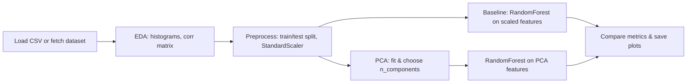

# Wine Quality PCA

This repository contains a compact, reproducible PCA-based feature-extraction demo for the UCI Wine Quality dataset (id=186). It includes:

- `main.py` — starter script to fetch the dataset and save `wine_ucirepo_186.csv`.
- `pca_demo.py` — end-to-end demo: EDA, preprocessing, PCA, baseline vs PCA models, plots, and a short results summary (saves outputs to `pca_outputs/`).
- `wine_ucirepo_186.csv` — the dataset (may be created by running `main.py`).
- `requirements.txt` — Python dependencies.

## Quickstart (Windows PowerShell)

Open PowerShell, change to the project folder and create a virtual environment, then install dependencies and run the demo:

```powershell
Set-Location -Path "c:\Projects\PCA_Analysis\Wine-Quality-Analysis-PCA"
python -m venv .venv
. .\.venv\Scripts\Activate
python -m pip install --upgrade pip
pip install -r requirements.txt

# Fetch dataset (optional if CSV already present)
python main.py

# Run the PCA demo (creates outputs in pca_outputs/)
python pca_demo.py
```

If you prefer WSL/Ubuntu, use `python3` and `source .venv/bin/activate` instead.

## What `pca_demo.py` does

- Loads `wine_ucirepo_186.csv` if present, otherwise attempts to fetch the dataset via `ucimlrepo` (id=186) and save it.
- Runs quick EDA (prints shape, head, describe) and saves feature histograms + correlation heatmap.
- Converts `quality` into a binary target: `good = (quality >= 7)`.
- Splits data (stratified), scales features (StandardScaler), trains a baseline RandomForest on scaled features.
- Fits PCA, plots cumulative explained variance (and selects n_components=0.95), trains the same classifier on PCA features.
- Saves confusion matrices, a 2-PC scatter plot, explained variance plot, and a short `results_summary.txt`.

## Outputs

After running `python pca_demo.py` you will find outputs in `pca_outputs/`:

- `feature_histograms.png` — feature distributions
- `correlation_heatmap.png` — feature correlation matrix
- `explained_variance.png` — cumulative explained variance vs components
- `pca_scatter.png` — PC1 vs PC2 scatter colored by binary target
- `confusion_baseline.png` — confusion matrix for baseline model
- `confusion_pca.png` — confusion matrix for PCA model
- `results_summary.txt` — short textual comparison (accuracy + classification reports)

## Pipeline (visual)


  # Wine Quality PCA

  This repository contains a compact, reproducible PCA-based demo for the UCI Wine Quality dataset (id=186). It provides both a small fetch script and an end-to-end demo that performs EDA, preprocessing, PCA, modeling, and saves plots and a short results summary.

  Top-level files

  - `main.py` — fetches the Wine Quality dataset via `ucimlrepo` (id=186) and saves `wine_ucirepo_186.csv`.
  - `pca_demo.py` — end-to-end script: loads CSV (or fetches it), runs EDA, preprocessing, PCA, trains models, and saves outputs to `pca_outputs/`.
  - `wine_ucirepo_186.csv` — the combined dataset (created by `main.py` when run).
  - `requirements.txt` — Python dependencies.
  - `run_demo.bat` — Windows batch file to automate venv creation, install, fetch, and demo run.
  - `Instructions.md` — step-by-step instructions for the assignment.

  ## Quickstart (Windows)

  Open PowerShell, change to the project folder and either run the bundled batch or run commands manually.

  Run the automated batch (recommended on Windows):

  ```powershell
  Set-Location -Path "c:\Projects\PCA_Analysis\Wine-Quality-Analysis-PCA"
  .\run_demo.bat
  ```

  Manual (PowerShell) — if you prefer to control each step:

  ```powershell
  Set-Location -Path "c:\Projects\PCA_Analysis\Wine-Quality-Analysis-PCA"
  python -m venv .venv
  . .\.venv\Scripts\Activate
  python -m pip install --upgrade pip
  pip install -r requirements.txt
  python main.py      # fetch dataset and save CSV
  python pca_demo.py  # run the PCA demo and save outputs
  ```

  If you use WSL/Ubuntu, replace `python` with `python3` and activate with `source .venv/bin/activate`.

  ## What the demo does

  - Loads `wine_ucirepo_186.csv` if present, otherwise fetches the dataset with `ucimlrepo` and saves it.
  - Runs quick EDA (prints shape, head, describe), saves histograms and a correlation heatmap.
  - Converts `quality` into a binary target by default (`good = quality >= 7`), but `pca_demo.py` can be adapted for regression or multi-class.
  - Splits data (stratified), scales features (StandardScaler), trains a baseline RandomForest on scaled features.
  - Fits PCA (visual 2-component scatter and n_components=0.95), trains the same classifier on PCA features, and compares metrics.
  - Saves plots and a short `results_summary.txt` into `pca_outputs/`.

  ## Outputs

  After running `pca_demo.py` you should find the following under `pca_outputs/`:

  - `feature_histograms.png` — feature distributions
  - `correlation_heatmap.png` — correlation matrix heatmap
  - `explained_variance.png` — cumulative explained variance
  - `pca_scatter.png` — PC1 vs PC2 scatter colored by target
  - `confusion_baseline.png` — confusion matrix for baseline model
  - `confusion_pca.png` — confusion matrix for PCA model
  - `results_summary.txt` — short textual comparison (metrics + classification reports)

  ## Running notes & troubleshooting

  - The demo uses `random_state=42` and `stratify=y` for reproducibility.
  - The bundled batch (`run_demo.bat`) creates and activates a `.venv`, installs packages, then runs `main.py` and `pca_demo.py` in sequence. If you prefer PowerShell-style activation or want the venv to remain active in your shell after the script runs, use the manual commands above.
  - The scripts require internet access the first time to fetch the dataset and to download packages. If your environment blocks outbound HTTP, run `main.py` on a machine with network access and copy `wine_ucirepo_186.csv` into the project.

  ## Next steps (optional enhancements)

  - Convert `pca_demo.py` into a Jupyter notebook (`pca_demo.ipynb`) for a more presentable assignment submission.
  - Replace the binary classification target with regression (predict raw `quality`) to make the task distinct from other PCA assignments.
  - Add PCA loadings and a short interpretation paragraph to the results summary to highlight which chemical features drive PC1/PC2.

  If you want, I can implement any of the optional enhancements and update the repository accordingly.

