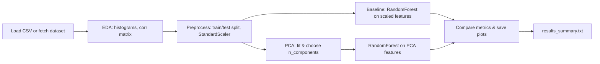

# Wine Quality PCA

This repository contains a compact, reproducible PCA-based feature-extraction demo for the UCI Wine Quality dataset (id=186). It includes:

- `main.py` — starter script to fetch the dataset and save `wine_ucirepo_186.csv`.
- `pca_demo.py` — end-to-end demo: EDA, preprocessing, PCA, baseline vs PCA models, plots, and a short results summary (saves outputs to `pca_outputs/`).
- `wine_ucirepo_186.csv` — the dataset (may be created by running `main.py`).
- `requirements.txt` — Python dependencies.

## Quickstart (Windows PowerShell)

Open PowerShell, change to the project folder and create a virtual environment, then install dependencies and run the demo:

```powershell
Set-Location -Path "c:\Projects\PCA_Analysis\Wine-Quality-Analysis-PCA"
python -m venv .venv
. .\.venv\Scripts\Activate
python -m pip install --upgrade pip
pip install -r requirements.txt

# Fetch dataset (optional if CSV already present)
python main.py

# Run the PCA demo (creates outputs in pca_outputs/)
python pca_demo.py
```

If you prefer WSL/Ubuntu, use `python3` and `source .venv/bin/activate` instead.

## What `pca_demo.py` does

- Loads `wine_ucirepo_186.csv` if present, otherwise attempts to fetch the dataset via `ucimlrepo` (id=186) and save it.
- Runs quick EDA (prints shape, head, describe) and saves feature histograms + correlation heatmap.
- Converts `quality` into a binary target: `good = (quality >= 7)`.
- Splits data (stratified), scales features (StandardScaler), trains a baseline RandomForest on scaled features.
- Fits PCA, plots cumulative explained variance (and selects n_components=0.95), trains the same classifier on PCA features.
- Saves confusion matrices, a 2-PC scatter plot, explained variance plot, and a short `results_summary.txt`.

## Outputs

After running `python pca_demo.py` you will find outputs in `pca_outputs/`:

- `feature_histograms.png` — feature distributions
- `correlation_heatmap.png` — feature correlation matrix
- `explained_variance.png` — cumulative explained variance vs components
- `pca_scatter.png` — PC1 vs PC2 scatter colored by binary target
- `confusion_baseline.png` — confusion matrix for baseline model
- `confusion_pca.png` — confusion matrix for PCA model
- `results_summary.txt` — short textual comparison (accuracy + classification reports)

## Pipeline (visual)



## Notes & reproducibility

- The demo uses `random_state=42` and `stratify=y` to keep runs reproducible.
- The script is defensive: if packages are missing it will print venv + install instructions.
- If you don't have network access or prefer not to fetch, ensure `wine_ucirepo_186.csv` is present in this folder before running `pca_demo.py`.

If you'd like, I can also:

- convert the demo into a Jupyter notebook (`pca_demo.ipynb`) with narrative cells, or
- add a small `requirements-dev.txt` and a GitHub Actions workflow to run the demo as a smoke test.

Happy to add either one — tell me which you'd prefer.

